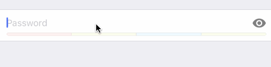

# GenericPasswordRow

<p align="left">
<a href="https://travis-ci.org/xmartlabs/GenericPasswordRow"></a>

<a href="https://developer.apple.com/swift"></a>
<a href="https://github.com/Carthage/Carthage"></a>
<a href="https://cocoapods.org/pods/GenericPasswordRow"></a>
<a href="https://raw.githubusercontent.com/xmartlabs/GenericPasswordRow/master/LICENSE"></a>
</p>

By [Xmartlabs SRL](http://xmartlabs.com).

## Contents
 * [Introduction](#introduction)
 * [Usage](#usage)
 * [Requirements](#requirements)
 * [Getting involved](#getting-involved)
 * [Examples](#examples)
 * [Installation](#installation)
 * [Customization](#customization)
 	* [GenericPasswordRow parameters](#genericpasswordrow-parameters)
 	* [Creating custom nib file](#creating-custom-nib-file)
 	* [Implement custom validation](#custom-password-validation)
 * [Roadmap](#roadmap)

## Introduction

`GenericPasswordRow` is a custom row for Eureka designed to create passwords. Its main purpose is to guide users through this process according to a set of validations.

* Features
  * Visibility
  * Password strength
  * Hints



## Usage

```swift
import GenericPasswordRow

class ViewController: FormViewController {

    override func viewDidLoad() {
        super.viewDidLoad()

        form +++ Section()
            <<< GenericPasswordRow()
    }
}
```

## Requirements

* iOS 8.0+
* Xcode 9.0+

## Getting involved

* If you **want to contribute** please feel free to **submit pull requests**.
* If you **have a feature request** please **open an issue**.
* If you **found a bug** or **need help** please **check older issues, [FAQ](#faq) and threads on [StackOverflow](http://stackoverflow.com/questions/tagged/CreditCardRow) (Tag 'CreditCardRow') before submitting an issue.**.

Before contribute check the [CONTRIBUTING](CONTRIBUTING.md) file for more info.

If you use **GenericPasswordRow** in your app we would love to hear about it! Drop us a line on [twitter](https://twitter.com/xmartlabs).

## Examples

Follow these steps to run Example project:
 * Clone GenericPasswordRow repository
 * Open terminal in the downloaded folder and run bin/setup script
 * Open GenericPasswordRow workspace
 * Run the *Example* project.

## Installation

#### CocoaPods

[CocoaPods](https://cocoapods.org/) is a dependency manager for Cocoa projects.

To install GenericPasswordRow, simply add the following line to your Podfile:

```ruby
pod 'GenericPasswordRow', '~> 3.0'
```

#### Carthage

[Carthage](https://github.com/Carthage/Carthage) is a simple, decentralized dependency manager for Cocoa.

To install GenericPasswordRow, simply add the following line to your Cartfile:

```ogdl
github "EurekaCommunity/GenericPasswordRow" ~> 3.0
```


## Customization

For basic styling like fonts, colors, margins, separators you should use `cellSetup` and `cellUpdate`. Otherwise, you should be able to provide a completely different design (different nib file) and reuse the already implemented logic.

### GenericPasswordRow parameters

* `var passwordValidator: PasswordValidator = DefaultPasswordValidator()`:
a PasswordValidator intended to define the rules to be satisfied by the password. See [Implement custom validation](#custom-password-validation)
* `var placeholder: String? = "Password"`: placeholder of password textfield.

For example you can do this:

```swift
<<< GenericPasswordRow() {
      $0.passwordValidator = // instantiate your custom validator
      $0.placeholder = "Create a password"
  }
```


### GenericPasswordCell parameters:

* `@IBOutlet weak var textField: UITextField!`:  
Password textfield.
* `@IBOutlet weak var visibilityButton: UIButton?`:  
Visibility button intended to toggle the `secureTextEntry` property of `textField`.
* `@IBOutlet weak var passwordStrengthView: PasswordStrengthView?`:  
A subclass of `PasswordStrengthView` with the custom design of the strength indicator. See [PasswordStrengthView](#custom-strength-view)
* `@IBOutlet weak var hintLabel: UILabel?`:  
Label used to show hints to the user while typing his password.
* `var visibilityImage: (on: UIImage?, off: UIImage?)`:  
Images to be set to the visibilityButton depending on the textField's `secureTextEntry` state.
* `var dynamicHeight = (collapsed: UITableViewAutomaticDimension, expanded: UITableViewAutomaticDimension)`:  
Heights of the cell when collapsed (with hintLabel hidden) and expanded (hintLabel not hidden). This property is nib-specific.


### Creating custom nib file

You might want to follow your own design. To accomplish this you should follow these steps:

* Create a user interface xib file and edit it with Xcode's Interface Builder. You should add a simple `UITableViewCell` and say that its class is a `GenericPasswordCell`.
* Add an UITextField for the password entry and connect it to the `textField` outlet.
* [optional] Add an UIButton and connect it to the `visibilityButton`.
* [optional] Add a [PasswordStrengthView](#custom-strength-view) subclass and connect it to the `passwordStrengthView` outlet.
* [optional] Add an UILabel and connect it to the `hintLabel` outlet.
* Specify that you want to use the newly created nib file. You can do this in two ways:
	* Using RowDefaults: use this if you want to use only this custom GenericPasswordRow in your app.

	```swift
	GenericPasswordRow.defaultRowInitializer = {
            $0.cellProvider = CellProvider<GenericPasswordCell>(nibName: "MyPasswordCell", bundle: nil)
        }
	```

	* Or create a custom row subclassing `_GenericPasswordRow`:

	```swift
	final class MyPasswordRow: _GenericPasswordRow, RowType {
	    required init(tag: String?) {
	        super.init(tag: tag)
	        cellProvider = CellProvider<GenericPasswordCell>(nibName: "MyPasswordCell", bundle: nil)
	    }
	}
	```

### Custom Strength View

If you are providing a custom nib file, you can also provide a custom subclass of `PasswordStrengthView` different from the [DefaultPasswordStrengthView](Sources/DefaultPasswordStrengthView.swift).
You just need to implement the following methods:
```swift
class PasswordStrengthView: UIView {

    public func setPasswordValidator(validator: PasswordValidator) { }
    public func updateStrength(password password: String, animated: Bool = true) { }

}
```
### Custom Password Validation

In order to provide a custom password validation you need to provide a conformance to the `PasswordValidator` protocol at the `passwordValidator` property of the `GenericPasswordRow` instance.

```swift
protocol PasswordValidator {

    var maxStrength: Double { get }
    func strengthForPassword(password: String) -> Double
    func hintForPassword(password: String) -> String?
    func isPasswordValid(password: String) -> Bool
    func colorsForStrengths() -> [Double: UIColor]

}
```

This validator should define the strength of any given password between zero and `maxStrength` values. Also, the `func colorsForStrengths() -> [Double: UIColor]` function should return a dictionary specifying key points of strength values and the associated color starting from there. See [DefaultPasswordValidator](Sources/DefaultPasswordValidator.swift).

## Author

* [Diego Ernst](https://github.com/dernster)

## What is on the roadmap?

What could be added to GenericPasswordRow:

* Implement some Eureka Validation
* Provide additional subclasses of `PasswordStrengthView`

# Change Log

This can be found in the [CHANGELOG.md](CHANGELOG.md) file.
